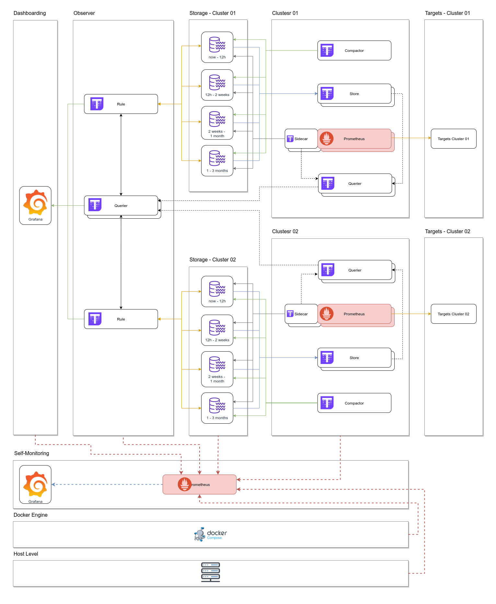

# Observability Sandbox

Get up and running with Prometheus, Thanos, Grafana, and more using Docker and Docker Compose

## Architecture Scheme

Following you can see an architecture scheme of the system.



## Fast Run

Clone this repo and execute the following command:

```
make up
```

## Services

The following services will be started. Some of them are accessible via web:

### Dashboarding

| Component                                  | Description                                                 | Port      |
| ---------------------------------------    | --------------------------------------------------------    | -------------------------------    |
| `grafana-server`                           | Grafana                                                     | [`3000`](http://localhost:3000)    |

### Storage

In this project I define two clusters. You can use it to store different kind of information, use to define different zones, etc.

I configure two replicas for each Prometheus server.

`cluster-01`

| Component                                  | Description                                                 | Port                               |
| ---------------------------------------    | --------------------------------------------------------    | -------------------------------    |
| `prometheus-server-cluster-01-r1`          | Prometheus (`labels: cluster=cluster-01, replica=r1`)       | [`9090`](http://localhost:9090)    |
| `prometheus-server-cluster-01-r2`          | Prometheus (`labels: cluster=cluster-01, replica=r2`)       | [`9092`](http://localhost:9092)    |
| `thanos-sidecar-prometheus-cluster-01-r1`  | Thanos Sidecar for Prometheus Server 1                      | N/A                                |
| `thanos-sidecar-prometheus-cluster-01-r2`  | Thanos Sidecar for Prometheus Server 2                      | N/A                                |
| `thanos-compactor-cluster-01`              | Thanos Compactor                                            | N/A                                |
| `thanos-querier-cluster-01`                | Thanos Querier                                              | [`10903`](http://localhost:10903)  |
| `thanos-store-gateway-cluster-01`          | Thanos Store                                                | N/A                                |
| `thanos-bucket-web-cluster-01`             | Web interface for remote storage bucket                     | [`10912`](http://localhost:10912)  |
| `minio-cluster-01`                         | Minio - Amazon S3 Compatible Object Storage                 | [`9011`](http://localhost:9011)    |

`cluster-02`

| Component                                  | Description                                                 | Port                               |
| ---------------------------------------    | --------------------------------------------------------    | -------------------------------    |
| `prometheus-server-cluster-02-r1`          | Prometheus (`labels: cluster=cluster-02, replica=r1`)       | [`9091`](http://localhost:9091)    |
| `prometheus-server-cluster-02-r2`          | Prometheus (`labels: cluster=cluster-02, replica=r2`)       | [`9093`](http://localhost:9093)    |
| `thanos-sidecar-prometheus-cluster-02-r1`  | Thanos Sidecar for Prometheus Server 3                      | N/A                                |
| `thanos-sidecar-prometheus-cluster-02-r2`  | Thanos Sidecar for Prometheus Server 4                      | N/A                                |
| `thanos-compactor-cluster-02`              | Thanos Compactor                                            | N/A                                |
| `thanos-querier-cluster-02`                | Thanos Querier                                              | [`10904`](http://localhost:10904)  |
| `thanos-store-gateway-cluster-02`          | Thanos Store                                                | N/A                                |
| `thanos-bucket-web-cluster-01`             | Web interface for remote storage bucket                     | [`10922`](http://localhost:10922)  |
| `minio-cluster-01`                         | Minio - Amazon S3 Compatible Object Storage                 | [`9021`](http://localhost:9021)    |

`thanos-observer`

We have multiple clusters with Thanos already installed. We need to configure a Thanos customresource with endpoints that point to these clusters.


| Component                                  | Description                                                 | Port                               |
| ---------------------------------------    | --------------------------------------------------------    | --------------------------------   |
| `thanos-querier`                           | Thanos Querier                                              | [`10902`](http://localhost:10902)  |

### Alerting

Alerting services

| Component                                  | Description                                                 | Port                               |
| ---------------------------------------    | --------------------------------------------------------    | --------------------------------   |
| `alertmanager`                             | Alertmanager                                                | [`9083`](http://localhost:9083)    |
| `thanos-ruler-cluster-01`                  | Thanos Ruler (`labels: cluster=cluster-01`)                 | N/A                                |
| `thanos-ruler-cluster-02`                  | Thanos Ruler (`labels: cluster=cluster-01`)                 | N/A                                |

### Self Monitoring

Dashboarding

| Component                                  | Description                                                 | Port                               |
| ---------------------------------------    | --------------------------------------------------------    | --------------------------------   |
| `grafana-server-self`                      | Grafana                                                     | [`3001`](http://localhost:3001)    |

Prometheus

| Component                                  | Description                                                 | Port                               |
| ---------------------------------------    | --------------------------------------------------------    | --------------------------------   |
| `prometheus-server-self-monitoring`        | Prometheus (`self: self`)                                   | [`9099`](http://localhost:9099)    |

Host metrics

| Component                                  | Description                                                 | Port                               |
| ---------------------------------------    | --------------------------------------------------------    | --------------------------------   |
| `cadvisor`                                 | cAdvisor                                                    | [`8010`](http://localhost:8010)    |
| `node-exporter`                            | Node Exporter                                               | [`9100`](http://localhost:9100)    |

## Contributing

For a complete guide to contributing to the project, see the [Contribution Guide](CONTRIBUTING.md).

We welcome contributions of any kind including documentation, organization, tutorials, blog posts, bug reports, issues, feature requests, feature implementations, pull requests, answering questions on the forum, helping to manage issues, etc.

The project community and maintainers are very active and helpful, and the project benefits greatly from this activity.

### Reporting Issues

If you believe you have found a defect in the project or its documentation, use the repository issue tracker to report the problem to the project maintainers.

If you're not sure if it's a bug or not, start by asking in the discussion forum. When reporting the issue, please provide the version.

### Submitting Patches

The project welcomes all contributors and contributions regardless of skill or experience level.

If you are interested in helping with the project, we will help you with your contribution.

We want to create the best possible tool for our development teams and the best contribution experience for our developers, we have a set of guidelines which ensure that all contributions are acceptable.

The guidelines are not intended as a filter or barrier to participation. If you are unfamiliar with the contribution process, the team will help you and teach you how to bring your contribution in accordance with the guidelines.

For a complete guide to contributing, see the [Contribution Guide](CONTRIBUTING.md).

## Code of Conduct

See the [code-of-conduct.md](./code-of-conduct.md) file

## License

See the [LICENSE](./LICENSE) file
